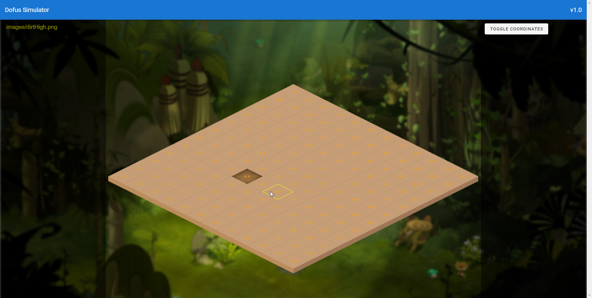

# dofus_simulator

Hobby Project to simulate a Dofus fight map and learn some more Vue.



Isometric calculations & inspiration of the implementation come from [this repository](https://github.com/nick-aschenbach/simple-isometric-tile-engine).

Based on this foundation I've made it work as a Vue Component.

## Project setup

```
npm install
```

### Compiles and hot-reloads for development

```
npm run serve
```
